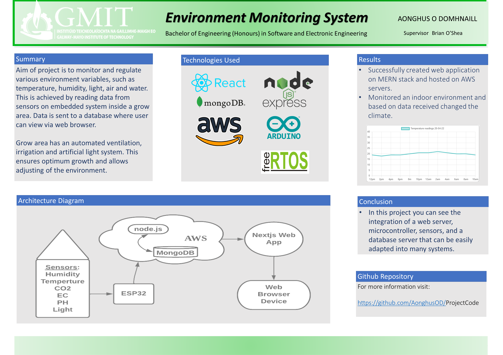

# Enviroment Monitor System On The MERN Stack
# MERN Stack Application 
## Enviroment Monitoring System 



# Getting Started

Nextjs and Nodejs can run independently using default data but any changes will be reverted back to defaults if page is refreshed. 

If data would like to be stored in a database, Mongodb will need to be installed and running "before" node server is started.

## [Mongodb Download](https://www.mongodb.com/try/download/community)

## [Good User Interface For Mongodb](https://studio3t.com)

```
Download folder "MERN Stack Site"
```
```
Create new folder "fsd" directly on the "C" drive.
```
```
Copy both "next" and "node" directories to "c/fsd.
```

## Install Dependencies and Start Servers

- Start command prompt or terminal

```
cd C:\fsd\node\node-blog
```
```
npm install
```
```
npm start
```
```
cd C:\fsd\next\nextjs-blog
```
```
npm install
```
```
npm run dev
```
Application can be seen running via internet browser at address:
```
https://localhost:3000/
```
# Project Overview

The scope of the project was mainly focused on deploying a full-stack web application using the MERN stack and using embedded C/C++ to write the code for ESP32.

Aim was to monitor and regulate various environment variables, such as temperature, humidity, light, air and water. This is achieved by reading data from sensors on embedded system inside a grow area. Data is sent to a database where user can view via web browser.

On the frontend, React was used with Next.js framework that provides faster rendering, server-side rendering, built-in CSS, better image optimization, and API support.

Node.js was used as middleware on the backend. Express server-side framework ran inside here too for URL routing and handling HTTP requests and responses.


ESP32 publishes an MQTT message to a topic on AWS IOT Core. Node.js is subscribed to the topic and saves incoming data to the Mongo DB database. The web application receives data from the database using Nodejs and an API. Data is then displayed on a web page.

